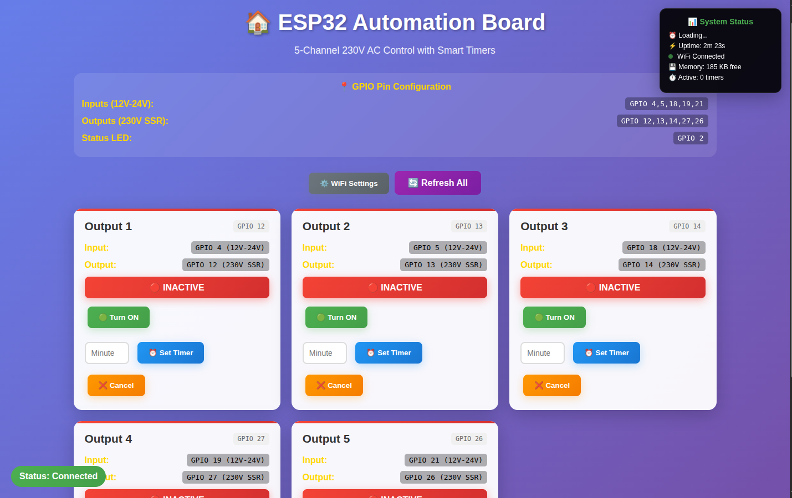

# ESP32 Automation Board

> **A compact industrial controller based on ESP32‑WROOM‑32D with opto‑isolated inputs, solid‑state relay outputs, and a sleek web interface for remote control and timer scheduling.**

---


[](LICENSE)    

---

## Table of Contents

1. [Features](#-features)
2. [Hardware Configuration](#-hardware-configuration)
3. [Web Interface](#-web-interface--network-access)
4. [PCB Design](#-custom-pcb-design)
5. [Safety](#-safety-considerations)
6. [Getting Started](#-getting-started)
7. [Troubleshooting](#-troubleshooting)
8. [Project Structure](#-project-structure)
9. [Contributing](#-contributing)
10. [License](#-license)
11. [Special Thanks](#-special-thanks-to-pcbway)

---

## 🌟 Features

### Hardware

* **4 Optocoupler Inputs** (12–24 V, PC817/PC827)
* **4 SSR Outputs** (230 V AC, ≤ 2 A @ 25 °C → derate 20 % @ 40 °C)
* **Galvanic Isolation** between I/O and MCU
* **Over‑Current & Surge Protection** with status monitoring
* **ESP32‑WROOM‑32D** dual‑core MCU, Wi‑Fi & BLE

### Software

* **Responsive Web UI** with real‑time I/O dashboard
* **mDNS** → `http://autoboard.local` access
* **Wi‑Fi STA + AP fallback** (captive portal)
* **Per‑channel Timers** (up to 24 h, FreeRTOS tasks)
* **Live Status Push** (every 2 s via SSE)
* **Verbose Logging** over UART for easy debug

---

## 🏗️ Hardware Configuration

### Pin Mapping

|  GPIO  |  Signal          |  Direction  |  Default  |  Notes           |
| ------ | ---------------- | ----------- | --------- | ---------------- |
|  2     |  Status LED      |  Output     |  LOW      |  On‑board LED    |
|  4     |  Input 1         |  Input      |  HIGH     |  Active LOW      |
|  5     |  Input 2         |  Input      |  HIGH     |  Active LOW      |
|  18    |  Input 3         |  Input      |  HIGH     |  Active LOW      |
|  19    |  Input 4         |  Input      |  HIGH     |  Active LOW      |
|  21    |  Input 5         |  Input      |  HIGH     |  Active LOW      |
|  12    |  Output 1        |  Output     |  LOW      |  SSR Active HIGH |
|  13    |  Output 2        |  Output     |  LOW      |  SSR Active HIGH |
|  14    |  Output 3        |  Output     |  LOW      |  SSR Active HIGH |
|  26    |  Output 4        |  Output     |  LOW      |  SSR Active HIGH |

> **Note :** Pin assignments can be changed in `auto_board_config.h`.

---

## 🌐 Web Interface & Network Access



* **Access** via `http://autoboard.local` once the board joins your Wi‑Fi.
* **First‑time setup** launches the **`Auto_Board_Setup`** AP with a captive portal (`192.168.4.1`).
* Real‑time I/O states refresh every 2 s without reloading the page.

---

## 🔌 Custom PCB Design


### Specs

* **2‑layer PCB** (signal + ground‑plane)
* **Dimensions :** 100 mm × 60 mm
* **Power Input :** 12–24 V DC
* **Operating Range :** ‑20 °C → +70 °C
* **Mounting :** DIN‑rail clip or M3 holes

---

## ⚠️ Safety Considerations

> 🟥 **DANGER — MAINS VOLTAGE (230 V AC) INSIDE**
> • Ensure galvanic isolation is intact before connecting live loads.
> • Test with a low‑voltage lamp first.
> • Comply with local electrical codes & EMC requirements.

---

## 🚀 Getting Started

<details>
<summary>Prerequisites</summary>

* **ESP‑IDF v4.4 or later**
* AutoBoard PCB with ESP32‑WROOM‑32D
* USB Type‑C/UART adapter
* Wi‑Fi network credentials

</details>

<details>
<summary>Build & Flash</summary>

```bash
# 1 · Clone
$ git clone https://github.com/your‑org/Auto_Board.git
$ cd Auto_Board

# 2 · Add mDNS component (one‑off)
$ idf.py add-dependency "espressif/mdns^1.2"

# 3 · Configure
$ idf.py menuconfig   # pick serial port, Wi‑Fi creds optional

# 4 · Build & Flash & Monitor
$ idf.py build flash monitor
```

</details>

Once flashed, open a browser and visit **`http://autoboard.local`**.

---

## 🛠️ Troubleshooting

|  Symptom                        |  Cause                        |  Fix                                                |
| ------------------------------- | ----------------------------- | --------------------------------------------------- |
| `autoboard.local` not resolving | Router blocks mDNS            | Use serial log to read IP or enable mDNS in router. |
| Repeated **404 favicon.ico**    | Browser tab icon request      | Add a 16×16 `favicon.ico` to `/spiffs`.             |
| SSR doesn’t switch load         | Wrong wiring / zero‑cross SSR | Verify live‑neutral wiring and load current < 2 A.  |

---

## 📁 Project Structure

```text
Auto_Board/
├── CMakeLists.txt
├── main/
│   ├── auto_board.c/.h
│   ├── auto_board_config.h
│   ├── auto_board_tasks.c
│   ├── web_server.c/.h
│   ├── wifi_config.c/.h
│   └── …
├── docs/ (PDF schematic, block diagram)
├── firmware/ (pre‑built binaries)
└── README.md (this file)
```

---

## 🤝 Contributing

1. Fork → feature branch → pull request.
2. Follow the **Git Conventional Commits** style.
3. Run `clang-format` & `idf.py size` before pushing.

---

## 📄 License

Distributed under the **MIT License**. See `LICENSE` for details.

---

## 🎉 Special Thanks to PCBWay

<div align="center">
  
</div>

*Huge thanks to [PCBWay](https://www.pcbway.com/) for fabricating the Auto Board PCBs — flawless silkscreen, sharp vias, quick turn!*
